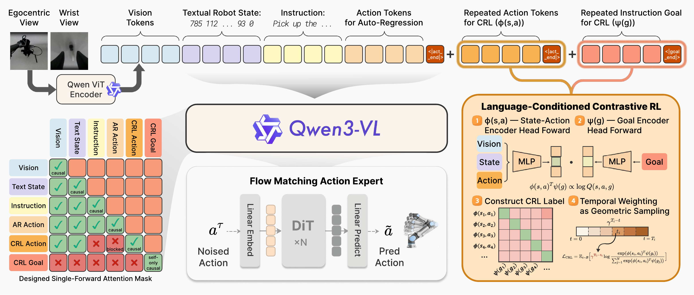
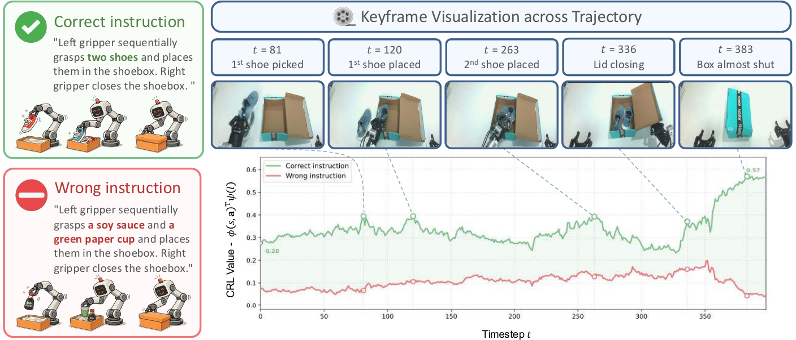
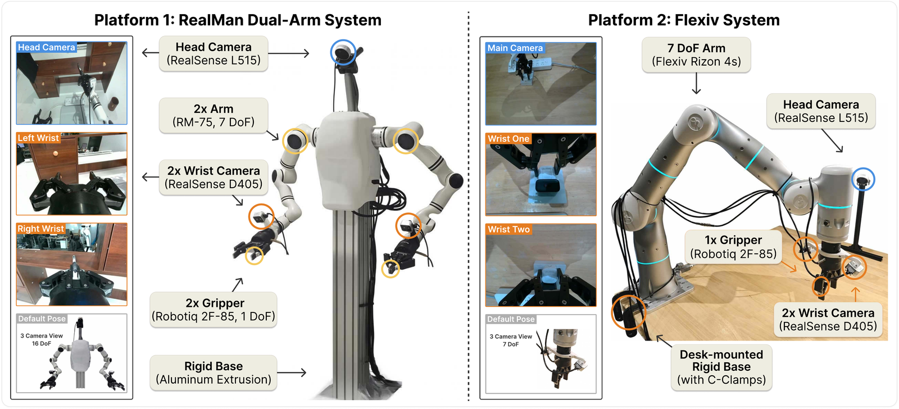
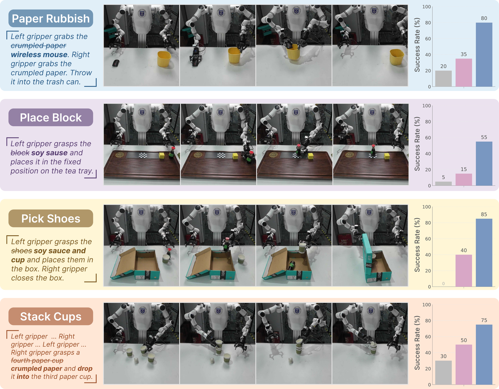
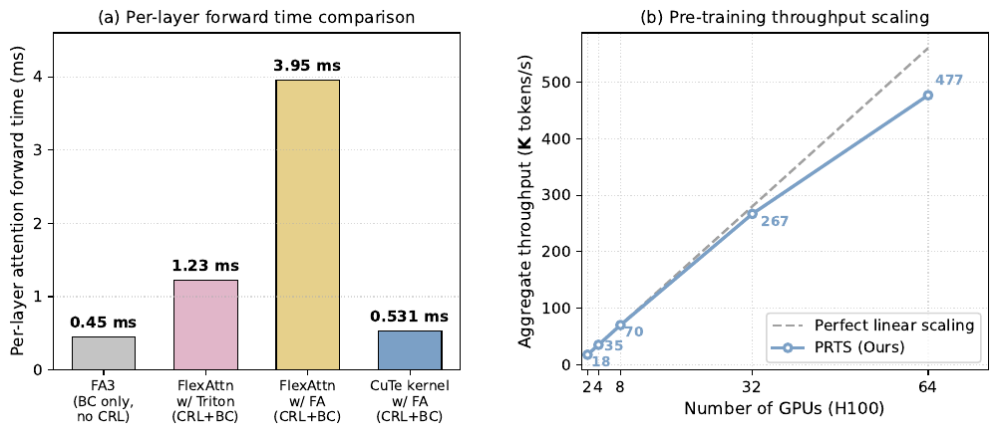

<div align="center">

# PRTS &mdash; Primitive Reasoning and Tasking System

### Scaling Reward-Free Contrastive RL into VLA Pre-training

[](https://arxiv.org/abs/2604.27472)
[](https://huggingface.co/TeleEmbodied/PRTS-4B)
[](https://rhodes-team-prts.github.io/)
[](LICENSE)



**A Vision&ndash;Language&ndash;Action foundation model that, for the first time, scales <em>reward-label-free</em> contrastive RL into VLA pre-training itself &mdash; equipping a single Qwen3-VL backbone with a quantitative, language-grounded sense of <em>goal-reachability</em>, at near-BC compute.**

</div>


## 📰 News

- **2026/05** &nbsp; Minimal SFT post-training code released &mdash; reproduces the LIBERO and real-robot fine-tuning runs from the paper.
- **2026/05** &nbsp; Pre-trained PRTS-4B checkpoint pushed to [🤗 TeleEmbodied/PRTS-4B](https://huggingface.co/TeleEmbodied/PRTS-4B).
- **2026/05** &nbsp; PRTS arXiv preprint released &mdash; [arXiv:2604.27472](https://arxiv.org/abs/2604.27472).


## 🚀 Release Plan

We will progressively open-source the rest of the PRTS stack. Tick = done, square = upcoming.

- [x] PRTS arXiv preprint &mdash; [arXiv:2604.27472](https://arxiv.org/abs/2604.27472)
- [x] PRTS-4B pre-trained checkpoint &mdash; [🤗 TeleEmbodied/PRTS-4B](https://huggingface.co/TeleEmbodied/PRTS-4B)
- [x] Standard LIBERO LeRobot-v2.1 dataset for example fine-tuning &mdash; [🤗 TeleEmbodied/libero_4_suites](https://huggingface.co/datasets/TeleEmbodied/libero_4_suites)
- [x] Minimal SFT post-training code for LIBERO + real-robot platforms
- [x] LIBERO evaluation of PRTS
- [ ] **Project page &mdash; ⚠️ <em>currently under maintenance, content out-of-date</em>** ; the site https://rhodes-team-prts.github.io/ will be refreshed in the next few days with final video demos, BibTeX, and benchmark cards.
- [ ] CRL value visualization scripts
- [ ] PRTS-4B post-trained checkpoints for LIBERO / SimplerEnv WidowX &mdash; the exact checkpoints behind Tables 1&ndash;4 of the paper, for one-click reproduction
<!-- - [ ] PRTS-4B post-trained checkpoints for our RealMan dual-arm and Flexiv single-arm real-robot suites -->
<!-- - [ ] Pre-training code (CRL data pipeline + role-aware CuTe-FlashAttention kernel) &mdash; gated on internal review -->

## ✨ Why PRTS?

Most VLA models pretrain by behavior cloning &mdash; they learn *what to do*, but never internalize *how close the current state is to satisfying the instruction*. PRTS reframes pre-training as a **goal-conditioned RL** problem and supervises a language-conditioned **contrastive value** alongside the action loss, all from offline trajectory structure alone.

The geometry the model converges to is sharp: the inner product

$$
\phi(s,\mathbf{a})^{\top}\psi(l) \approx \log Q^{\pi}_{l}(s,\mathbf{a})
$$

of the state&ndash;action embedding and the goal embedding tracks the log-discounted goal-occupancy along expert rollouts. It rises as the policy approaches the language goal, and stays flat under a mismatched instruction.

<table>
<tr>
<td width="55%">

</td>
<td>

**Value visualization on a held-out *Pick Shoes* rollout.**
Same physical trajectory; two language conditionings.
**Green** &mdash; correct instruction: the value rises with subgoal-aligned local peaks at *first shoe lifted* &nbsp;&rarr;&nbsp; *first shoe placed* &nbsp;&rarr;&nbsp; *second shoe placed* &nbsp;&rarr;&nbsp; *box almost shut*, climbing to `0.57` over the episode.
**Red** &mdash; wrong instruction (objects that don't appear in the scene): the score stays in `0.04 ~ 0.20` and never crosses the green curve in any frames.

The signal is computed by the **pre-trained checkpoint without any post-training adaptation**.

</td>
</tr>
</table>

### Highlights

| | |
|---|---|
| 🧭 **Goal-reachability awareness, end-to-end** | The contrastive value head is co-trained inside the same Qwen3-VL backbone the policy uses. No separate value network, no curated reward dataset, no offline-RL post-training loop. |
| 💰 **Reward-label-free** | Supervision comes *purely* from the temporal structure of demonstrations &mdash; no per-episode success labels and no curated value-training corpus. |
| ⚡ **Near-BC pre-training cost** | A role-aware causal mask fused into FlashAttention via a custom CuTe kernel keeps per-layer attention within **`1.18 ×`** of vanilla FA3, vs. `2.7 ×–8.8 ×` for off-the-shelf FlexAttention. End-to-end pre-training scales at **`≥ 85 %`** linear efficiency on 64 × H100. |
| 🌍 **Out-of-distribution wins grow with the shift** | On 5 simulation suites and 14 real-world tasks, PRTS matches or exceeds the strongest prior VLAs at **¼ &ndash; ⅛** the post-training compute, with the gap **widening** as evaluation moves further off-distribution: novel-instruction following (`+38.8` over &pi;<sub>0.5</sub>), long-horizon execution, and recovery under human intervention. |


## 🛠️ Getting Started

### 1. Environment

PRTS targets **CUDA 12.6 + PyTorch 2.11 + transformers 4.57.3**. We recommend a fresh conda env:

```bash
# 1) Clone
git clone https://github.com/TeleEmbodied/PRTS.git
cd PRTS

# 2) Create env
conda create -n prts python=3.11 -y
conda activate prts

# 3) Install LeRobot first
pip install lerobot==0.3.3

# 4) Install the rest
pip install -r requirements.txt

# 5) FlashAttention installation (we recommend FlashAttention-3, which is the default attn implementation in our training, i.e., `--attn-implementation flash_attention_3`)
MAX_JOBS=8 pip install flash-attn==2.8.3 --no-build-isolation # only for FA2

# 6) Editable install of PRTS itself
pip install -e .
```

### 2. Download the pre-trained checkpoint

```bash
huggingface-cli download TeleEmbodied/PRTS-4B \
    --local-dir $HF_HUB_CACHE/models--TeleEmbodied--PRTS-4B
huggingface-cli download Qwen/Qwen3-VL-4B-Instruct \
    --local-dir $HF_HUB_CACHE/models--Qwen--Qwen3-VL-4B-Instruct
```

### 3. Fine-tune on your own LeRobot dataset

Fine-tuning is driven by a single YAML pointing at one or more **LeRobot v2.1** datasets (local folder or HF repo). A minimal config (see [`configs/post-train/template.yaml`](configs/post-train/template.yaml)):

```yaml
# configs/post-train/my_robot.yaml
lerobot_datasets:
  - repo_id: my_robot_v1                       # any string id, used for logging
    root: /path/to/your/lerobot_dataset        # local v2.1 LeRobot folder
    load_quantile_stats: true                  # load q01/q99 from meta/stats.json (run compute_stats.py first before starting fine-tuning)
    state_relative_action: false               # true = train on (action - state); must match `embodiment_tag`
    embodiment_tag: my_robot_tag               # see prts/data/embodiment_tag.py
```

**Key fields explained:**

| Field | Meaning |
|---|---|
| `repo_id` | Dataset short name. Doubles as a tag in the loss-channel logs (`flow_matching/<repo_id>`). |
| `root` | Absolute path to a v2.1 LeRobot dataset folder (must contain `meta/info.json`, `meta/episodes.jsonl`, `meta/stats.json`, …). |
| `load_quantile_stats` | If `true`, loads `q01/q99` from `meta/stats.json` for `QUANTILE` normalization. Generate them once with `python scripts/compute_stats.py --config <your.yaml>`. |
| `state_relative_action` | `true` makes the policy predict `action − state` for the dims masked in the embodiment config. Must agree with the `embodiment_tag` you choose. |
| `embodiment_tag` | One of the keys in [`prts/data/embodiment_tag.py`](prts/data/embodiment_tag.py): `libero_panda`, `flexiv`, `realman_dual_arm`, `arx_dual_arm`, `galaxea_r1_pro`, `agibot_g2`, or the generic `full_state_relative` / `full_absolute`. To add a new robot, append a new `EmbodimentConfig` entry — the `delta_action_mask` is truncated to your real action dim at runtime. |

You can list **multiple datasets** under `lerobot_datasets:` and they will be co-trained with sample-level mixing.

### 4. Launch the fine-tune

Edit the top of [`scripts/ft/launch_finetune.sh`](scripts/ft/launch_finetune.sh) — these are the knobs you will most often touch:

```bash
GPUS=4                                              # number of local GPUs
PER_DEVICE_BATCH_SIZE=8
dataset_config_path=configs/post-train/my_robot.yaml
embodiment_tag=my_robot_tag                         # must match the YAML above
chunk_size=20                                       # action horizon
action_dim=32                                       # >= max action dim across listed datasets
max_train_steps=30000
state_mode=QUANTILE                                  # or MEAN_STD / MIN_MAX
model_name_or_path=$HF_HUB_CACHE/models--TeleEmbodied--PRTS-4B  # or "TeleEmbodied/PRTS-4B"
```

Then:

```bash
# 1) Pre-compute normalization statistics. This walks each dataset listed under
#    `lerobot_datasets:` once and writes `<root>/meta/norm_stats.json`
#    (mean/std/min/max + q01/q99) — the same file `load_quantile_stats: true`
#    reads at training time.
python scripts/compute_stats.py \
    --data_path configs/post-train/my_robot.yaml

# 2) Launch SFT (DeepSpeed ZeRO-2 by default)
bash scripts/ft/launch_finetune.sh
```

Checkpoints land under `outputs/<date>/<time>-<run_name>/` and the final policy is saved as `checkpoint-final-<step>/`.

### Serving a trained policy

`scripts/serve_policy.py` does **not** accept a `--ckpt-path` flag — checkpoints are looked up via an `EnvMode` enum and a `DEFAULT_CHECKPOINT` table. To serve your own run, register a new entry in both:

```python
# scripts/serve_policy.py

class EnvMode(enum.Enum):
    ALOHA      = "aloha"
    ALOHA_SIM  = "aloha_sim"
    DROID      = "droid"
    LIBERO     = "libero"
    SIMPLER    = "simplerenv"
    LIBERO_hf  = "libero_dit"
    MY_ROBOT   = "my_robot"          # ← add this

DEFAULT_CHECKPOINT: dict[EnvMode, Checkpoint] = {
    ...
    EnvMode.MY_ROBOT: Checkpoint(    # ← and this
        config       = "prts_my_robot",
        dir          = "outputs/2026-XX-XX/.../checkpoint-final-30000",
        action_dim   = 7,                       # must match your dataset action dim
        dataset_path = "/path/to/your/lerobot_dataset",
        state_mode   = "QUANTILE",              # must match normalization mode used at training
        state_relative_action = False,          # must match the YAML used at training
    ),
}
```

Then launch the websocket policy server (consumed by the OpenPI client included in `third_party/openpi-client`):

```bash
python scripts/serve_policy.py --env my_robot --port 10093
```

The four fields `action_dim / dataset_path / state_mode / state_relative_action` **must agree with the YAML used during fine-tuning** — they are how the server reconstructs the un-normalization pipeline so that the actions returned over the websocket are in the same convention your robot expects.

### 5. Examples on LIBERO

The repo ships a ready-to-run config so you can confirm the stack end-to-end before pointing it at your own data. We also released the LeRobot-v2.1 packaging of the four LIBERO suites we used for the paper at [🤗 TeleEmbodied/libero_4_suites](https://huggingface.co/datasets/TeleEmbodied/libero_4_suites) — pull it down once and the rest is one shell command:

```bash
# 1) Download the LIBERO LeRobot dataset
huggingface-cli download TeleEmbodied/libero_4_suites \
    --repo-type dataset \
    --local-dir /path/to/libero_4_suites

# 2) Point configs/post-train/libero.yaml at the folder you just downloaded
#    (edit the `root:` field), then:

# 3) Launch SFT
bash scripts/ft/launch_finetune.sh
```

A successful run prints `total_params=…, trainable_params=…, [≈99 %]` at startup and begins logging `flow_matching/libero_4_suites_channel_loss` within the first ~100 steps.


## 📊 Results

### Standard simulation benchmarks

PRTS reaches state-of-the-art average success rate on every standard suite, **at a small post-training budget among all directly comparable VLAs**.

| Method | LIBERO | LIBERO-Plus | LIBERO-Pro | SimplerEnv (WidowX) |
| :--- | :---: | :---: | :---: | :---: |
| OpenVLA-OFT | 97.1 | 69.6 | &mdash; | 41.8 |
| GR00T-N1.5  | 97.0 | &mdash; | &mdash; | 61.9 |
| &pi;<sub>0</sub> &nbsp;<sup>(bs=32,&nbsp;30K)</sup> | 94.2 | 53.6 | 45.3 | 27.1 |
| &pi;<sub>0.5</sub> &nbsp;<sup>(bs=256,&nbsp;30K)</sup> | 96.9 | 80.7 | 53.3 | &mdash; |
| ABot-M0 &nbsp;<sup>(bs=32,&nbsp;30K)</sup> | 97.9 | 78.7 | 52.2 | &mdash; |
| **PRTS (Ours)** &nbsp;<sup>(bs=32,&nbsp;30K)</sup> | **98.4** | **81.4** | **58.8** | **77.1** |

The gap to baselines **grows** as evaluation drifts further off-distribution: `+0.5` on LIBERO &nbsp;&rarr;&nbsp; `+0.7` on LIBERO-Plus &nbsp;&rarr;&nbsp; `+5.5` on LIBERO-Pro.

### LIBERO-Pro: novel instruction & position swapping

This is where PRTS's CRL shaped representations really earn its keep. The benchmark holds the visual scene fixed and rewrites either the instruction (**Task** axis) or the target relation (**Position** axis).

| Method | Semantic | Object | Position | **Task** | **Average** |
| :--- | :---: | :---: | :---: | :---: | :---: |
| &pi;<sub>0</sub> &nbsp;<sup>(bs=32, 30K)</sup> | 90.5 | 90.5 | 0.0 | 0.0 | 45.3 |
| &pi;<sub>0.5</sub> &nbsp;<sup>(bs=256, 30K)</sup> | 95.8 | **96.0** | 20.8 | 0.8 | 53.3 |
| ABot-M0 &nbsp;<sup>(bs=32, 30K)</sup> | 97.1 | 82.5 | 7.1 | 22.3 | 52.2 |
| **PRTS (Ours)** &nbsp;<sup>(bs=32, 30K)</sup> | 97.0 | 82.3 | **24.3** | **31.5** | **58.8** |

On the **Task** axis, &pi;<sub>0</sub> and &pi;<sub>0.5</sub> collapse below `1 %`, and the strongest comparable VLA (ABot-M0) reaches only `22.3 %`. PRTS holds **`31.5 %`** &mdash; although &pi;<sub>0.5</sub> achieves the second-best average result, PRTS suprisingly outperform it a large margin `+30.7` on the hardest **Task** axis.

### Real-world: 14 tasks across 2 platforms

<p align="center">
  
</p>

We deploy PRTS on a 14-DoF dual-arm RealMan platform (11 tasks) and a 7-DoF Flexiv single-arm platform (3 tasks). All three policies (`PRTS`, &pi;<sub>0</sub>, &pi;<sub>0.5</sub>) share **identical post-training data, schedule, and 20-trial physical evaluation protocol**.

| Method | RealMan dual-arm (avg over 11 tasks) | Flexiv single-arm (avg over 3 tasks) |
| :--- | :---: | :---: |
| &pi;<sub>0</sub> | 67.3 | 60.0 |
| &pi;<sub>0.5</sub> | 85.5 | 75.0 |
| **PRTS (Ours)** | **95.9** | **90.0** |

PRTS hits **`≥ 90 %`** on every one of the 11 RealMan tasks and **`100 %`** on four of them. On the genuinely long-horizon **Office Long Term** task (~2 min of continuous bimanual operation), &pi;<sub>0.5</sub> collapses to `40 %` under multi-task interference while PRTS holds `95 %`.

### Zero-shot novel-instruction generalization

The cleanest test of "does the policy follow the language goal?" is to take a deployed task and **change the language instruction** to recombine seen primitives in a new way (e.g. *Paper Rubbish* with a soy-sauce bottle in place of the trash item). All four task-generalization cells, all 20 trials physical:

<p align="center">
  
</p>

| Method | Paper Rubbish | Place Block | Pick Shoes | Stack Cups | **Average** |
| :--- | :---: | :---: | :---: | :---: | :---: |
| &pi;<sub>0</sub> | 5.0 | 0.0 | 30.0 | 20.0 | 13.8 |
| &pi;<sub>0.5</sub> | 65.0 | 15.0 | 35.0 | 25.0 | 35.0 |
| **PRTS (Ours)** | **80.0** | **55.0** | **85.0** | **75.0** | **73.8** |

`+38.8` average margin over &pi;<sub>0.5</sub> &mdash; the most direct empirical evidence that PRTS's value head ties the language goal to feasible state-action outcomes.

### Pre-training efficiency

<p align="center">
  
</p>

**(a)** Aggregate token throughput vs. number of H100 GPUs (log-log) &mdash; PRTS retains **`≥ 85 %`** of perfect linear scaling up to 64 GPUs. **(b)** Per-layer attention forward time at matched packing &mdash; our role-aware CuTe-FlashAttention kernel sits at **`0.531 ms / layer`** (`1.18 ×` of the BC-only FA3 reference at `0.45 ms`), versus `1.23 ms` (`2.7 ×`) and `3.95 ms` (`8.8 ×`) for the alternative FlexAttention realizations of the same role-aware mask.


## 📚 Citation

If you find PRTS useful, please consider citing:

```bibtex
@article{zhang2026prts,
  title   = {PRTS: A Primitive Reasoning and Tasking System via Contrastive Representations},
  author={Yang Zhang and Jiangyuan Zhao and Chenyou Fan and Fangzheng Yan and Tian Li and Haitong Tang and Sen Fu and Xuan'er Wu and Qizhen Weng and Weinan Zhang and Xiu Li and Chi Zhang and Chenjia Bai and Xuelong Li},
  journal = {arXiv preprint arXiv:2604.27472},
  year    = {2026},
}
```

## 📄 License

[Creative Commons Attribution-NonCommercial 4.0 (CC BY-NC 4.0)](https://creativecommons.org/licenses/by-nc/4.0/). See [LICENSE](LICENSE) for details. Released model weights and code are free for academic and non-commercial use; commercial use is not permitted under this license.

## 🙏 Acknowledgements

PRTS builds on [Qwen3-VL](https://github.com/QwenLM/Qwen3-VL), [FlashAttention](https://github.com/Dao-AILab/flash-attention), [LeRobot](https://github.com/huggingface/lerobot), and [OpenPI](https://github.com/openpilab/openpi). We thank the authors of [Contrastive RL](https://github.com/google-research/google-research/tree/master/contrastive_rl) for the ideas behind the contrastive value formulation.

## 📬 Contact

Feel free to open an issue or discussion if you encounter any problems or have questions about this project.

For collaborations, feedback, or further inquiries, please reach out to Yang Zhang (**breezeyoung9470@gmail.com**).

You can also join our WeChat discussion group for timely Q&A:

<p align="center">
  
</p>

<p align="center"><sub>(QR code refreshed weekly &mdash; if it has expired, please email and we will update it.)</sub></p>
